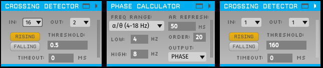

# TORTE
Welcome to the Toolkit for Oscillatory Real-Time Tracking and Estimation repo by TNE-LAB. Here we provide links to necessary code repository's and basic implementation steps.  See [biorxiv preprint](https://www.biorxiv.org/content/10.1101/2021.06.21.449019v1).

## Installation

### Open Ephys
Open Ephys GUI is where the real time analytic signal estimation algorithm is built. Installation and usage information can be found at both their website (https://open-ephys.org/gui) and github (https://github.com/open-ephys/plugin-GUI)


### Open Ephys Plugins
TORTE uses a few plugins for Open Ephys that need to be installed by the user. Open Ephys GUI provides a plugin installer that includes all required plugins. If users would rather build these plugins from source code they may follow the links provided. These include:

- Phase Calculator (https://github.com/tne-lab/phase-calculator)
- Crossing Detector (https://github.com/tne-lab/crossing-detector)
- Event Broadcaster (https://github.com/open-ephys-plugins/ZMQInterface)
- Coherence and Spectrogram Viewer (https://github.com/tne-lab/Coherence-Spectrogram-Viewer)

For neural data to be received by Open Ephys GUI the user may also need to install acquisition system plugins. Some, but not all of these are included in the plugin installer. If not included they must be built from source. This list is not exhaustive and users should reach out to TORTE/Open Ephys GUI team if their system is not on the list.

- EphysSocket for receiving matrix data over UDP (https://github.com/open-ephys-plugins/EphysSocket)
- Neuropixels-pxi (https://github.com/open-ephys-plugins/neuropixels-pxi)
- Neuralynx Plugin (https://github.com/tne-lab/neuralynx-plugin)
- LSL-inlet (https://github.com/tne-lab/LSL-inlet)

### 0MQ
0MQ is used by Open Ephys GUI to broadcast event timings. One of the many supported programming languages needs to be installed (https://zeromq.org/get-started/).

We recommend using Python (https://www.python.org/) because its easy to use and supports plenty of experiments. We also provide some basic 0MQ example code for Python.

## Usage

### Analytic Signal Extraction
Once installed the first thing to do is create a signal chain within Open Ephys to extract oscillatory activity. A basic signal chain is as follows:

Data input plugin -> Referencing plugin (optional) -> Phase Calculator -> Crossing Detector -> Event Broadcaster


- Data input plugin
  - Any of multitude of plugins available 
  - All these plugins are sources (orange)
- Referencing plugin (optional)
  - Depending on your data input you may want to do some type of referencing to reduce noise.
- Phase Calculator
  - Algorithm plugin to track oscillatory components
  - Note this can track either phase or magnitude 
  - See github page for more detailed documentation
- Crossing Detector
  - Used to create events when oscillatory components pass some threshold
- Event Broadcaster
  - Output the event outside of the Open Ephys environment
  - Must be in json + header mode


See example signal chain config file that can be loaded into Open Ephys (example_config.xml). This config was created in version 0.5.4 so may not be compatible with newer versions. 

### 0MQ
Provided Python code gives an example of receiving data from Open Ephys. The provided code simply prints out the event received. 

```
    socket = context.socket(zmq.SUB)
    socket.connect("tcp://localhost:5557")
    #Have to Set to the beginning for the envelope!
    socket.setsockopt(zmq.SUBSCRIBE, [b'event', b'ttl'])
```
Here we are connecting to the local host port 5557 as a SUB. We will receive every event tagged with a ttl or event. Our crossing detector will output "ttl" or "event" events. 

```
envelope, jsonStr = socket.recv_multipart()
```

We split apart the json string from the header. Then print out the json string. Change the print to trigger the stimuli in your experiment. 

### Real time visual feedback
To use the coherence and spectrogram viewer wer recommend splitting the signal chain right before your phase calculator.


See documentation on the github page for instructions on use.

### Record Node
Open Ephys uses record nodes to record data from specific plugins. Be sure to place these wherever you want to record data from. 

### Learning algorithm
If running a phase based closed loop experiment we recommend implementing the builtin learning algorithm. 



The first crossing detector here needs to be looking at inputted sham events and must output on a different event channel than the event triggering crossing detector (the second one). 

### Edit hilbert coefficients
As mentioned in the publication, alternate Hilbert filters may work better for specific oscillation use cases. See [Hilbert README](./hilbertcoeff.md) to see a step by step guide to creating filters. 
