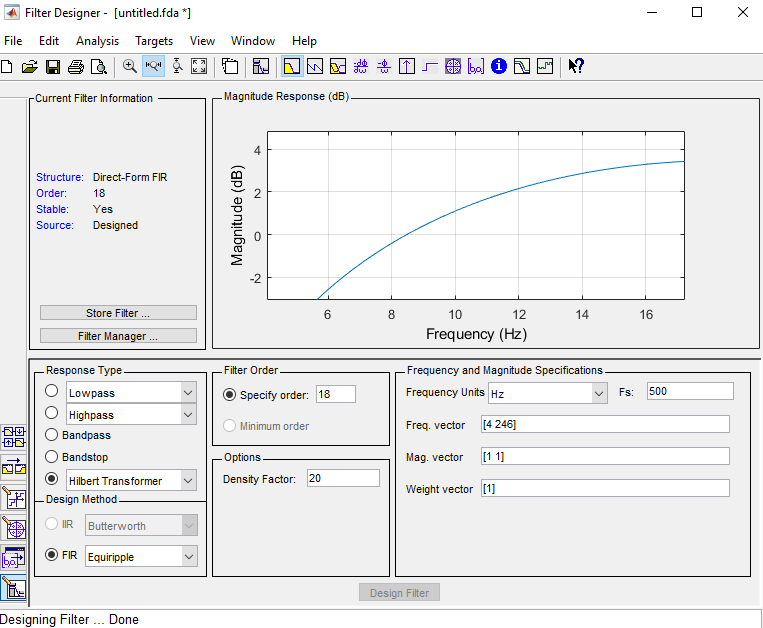
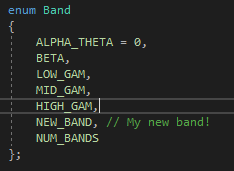
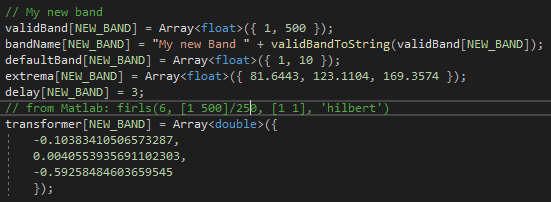

# Creating new Hilbert Transforms
Analysis-signal plugin must be built from source. (https://github.com/tne-lab/phase-calculator).

## Create the filter
The easiest method to designing a new filter is using Matlabs filterDesigner. But any method to create a Parks-McClellan optimal FIR filter design would work. See scipy remez function for a Python implementation. https://docs.scipy.org/doc/scipy/reference/generated/scipy.signal.remez.html

Here is the an example filterDesigner for the builtin theta/alpha filter. Note two tradeoffs that need to be attended. 
- First the filter order. A lower order means less time delay which will result in more accurate results. 
- Then the magnitude response. Ideally the filter magnitude response is equal across all frequencies of interest. This band is built to be reasonably flat from 4-18hz as shown here. 

You can then file->Generate Matlab Code->Filter Design Function to automatically generate code to get your coefficients. Run the new function and save the b variable that is generated. These are your coefficients. Note the first and second half of the coefficients will be the same. Save the first half of the coefficients (filter-order/2), the second half is just the inverse of the first half. 

## Implement the filter
Within "HTransformers.h" file found in the source folder, add your new "band" to the enum Band function. ie

Then update with your new coefficients (remember just the first half of the b variable from above) in "HTransformers.cpp". Set delay to filter-order/2. ie

Re-install your plugin and your new band will now available to select in the plugin GUI. 
